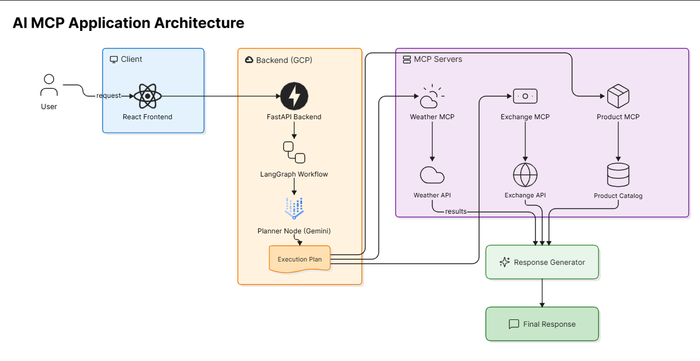

# Autonomous Agent Platform

A multi-tool autonomous AI agent platform built using **LangGraph**, **MCP (Model Context Protocol)**, **FastAPI**, **React**, and **Google Gemini**.

The platform allows users to submit natural language requests, automatically generates an execution plan, invokes one or more MCP tools, and produces a final human-friendly response.

---

## Project Overview

The Autonomous Agent Platform demonstrates how Large Language Models can orchestrate multiple tools through MCP servers using LangGraph workflows.

The application supports:

* Weather Information Retrieval
* Currency Conversion
* Product Search
* Shopping Cart Operations
* Multi-Step Autonomous Planning
* MCP Tool Discovery
* Execution Visualization

---

## Architecture

```text
User
  │
  ▼
React Frontend
  │
  ▼
FastAPI Backend
  │
  ▼
LangGraph Workflow
  │
  ▼
Planner Node (Gemini)
  │
  ▼
Execution Plan
  │
  ├──────────────┬──────────────┬──────────────┐
  ▼              ▼              ▼
Weather MCP   Exchange MCP   Product MCP
  │              │              │
  ▼              ▼              ▼
External API   External API   Product Catalog
  │              │              │
  └──────────────┴──────────────┘
                 │
                 ▼
         Response Generator
                 │
                 ▼
            Final Response
```

---
# Screenshots


## Multi-Step Agent Execution


## Features

### Autonomous Planning

The platform automatically generates a multi-step execution plan using Gemini.

Example:

User Query:

```text
What is the weather in London and convert 1000 USD to GBP?
```

Generated Plan:

```text
1. get_weather
2. convert_currency
```

---

### MCP Server Integration

The application integrates multiple MCP servers:

#### Product MCP Server

Supported Tools:

* search_products
* get_product_by_name
* list_categories
* add_to_cart
* view_cart
* checkout

---

#### Weather MCP Server

Supported Tools:

* get_weather

Uses external weather APIs to retrieve real-time weather information.

---

#### Exchange MCP Server

Supported Tools:

* convert_currency

Uses external exchange-rate APIs to perform real-time currency conversion.

---

### LangGraph Workflow

Workflow Nodes:

* Planner Node
* MCP Execution Node
* Response Generator Node

The workflow supports multi-step tool execution and aggregation of results.

---

## Technology Stack

### Backend

* FastAPI
* LangGraph
* MCP
* Google Gemini
* Python

### Frontend

* React
* Vite
* Tailwind CSS

### APIs

* Weather API
* Exchange Rate API

---

## Project Structure

```text
shopping-agent-mcp/
│
├── api/
│   └── main.py
│
├── client/
│   ├── client.py
│   └── langgraph_client.py
│
├── graph/
│   ├── workflow.py
│   ├── nodes.py
│   └── state.py
│
├── servers/
│   ├── product_server.py
│   ├── weather_server.py
│   └── exchange_server.py
│
├── shared/
│   ├── mcp_client.py
│   └── utils.py
│
├── frontend/
│
├── requirements.txt
├── README.md
└── .env
```

---

## Installation

### Clone Repository

```bash
git clone <repository-url>
cd shopping-agent-mcp
```

---

### Create Virtual Environment

```bash
python -m venv sam
```

Activate:

```bash
sam\Scripts\activate
```

---

### Install Dependencies

```bash
pip install -r requirements.txt
```

---

### Configure Environment Variables

Create a `.env` file:

```env
GEMINI_API_KEY=YOUR_API_KEY
WEATHER_API_KEY=YOUR_API_KEY
EXCHANGE_API_KEY=YOUR_API_KEY
```

---

## Run Backend

```bash
uvicorn api.main:app --reload
```

Backend:

```text
http://localhost:8000
```

Swagger UI:

```text
http://localhost:8000/docs
```

---

## Run Frontend

```bash
cd frontend
npm install
npm run dev
```

Frontend:

```text
http://localhost:5173
```

---

## Sample Query

```text
What is the weather in London and convert 1000 USD to GBP?
```

---

## Future Enhancements

* Dynamic MCP Discovery
* MCP Server Registration Dashboard
* User Authentication
* Persistent Conversation History
* RAG-Based Knowledge MCP
* Vector Database Integration
* Azure / GCP Deployment
* Multi-Agent Collaboration

---

## Learning Objectives

This project was built to learn:

* LangGraph
* MCP Architecture
* Tool Calling Agents
* Autonomous Planning
* FastAPI
* React
* Gemini Integration
* Multi-Step Agent Workflows

---

## Author

**Abhijeet M Supnekar**

Developed as a personal learning project to explore modern Agentic AI architectures using MCP and LangGraph.
